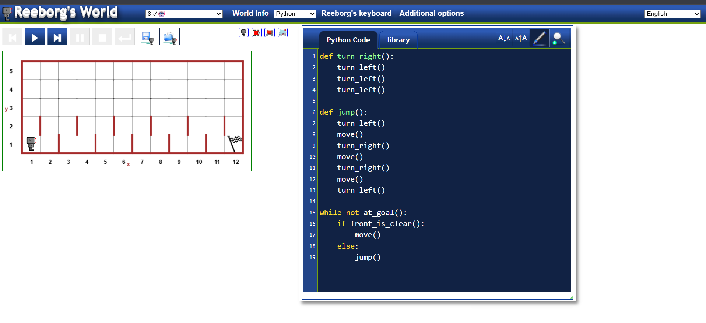
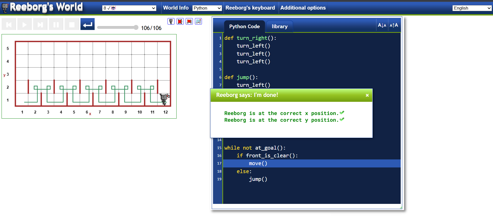
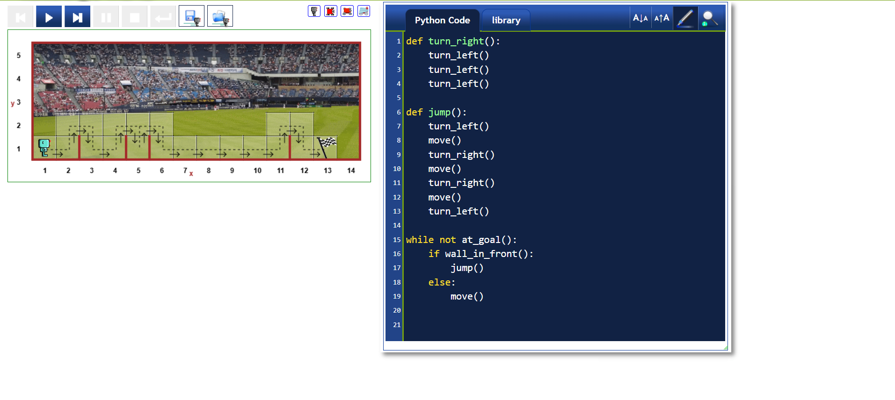
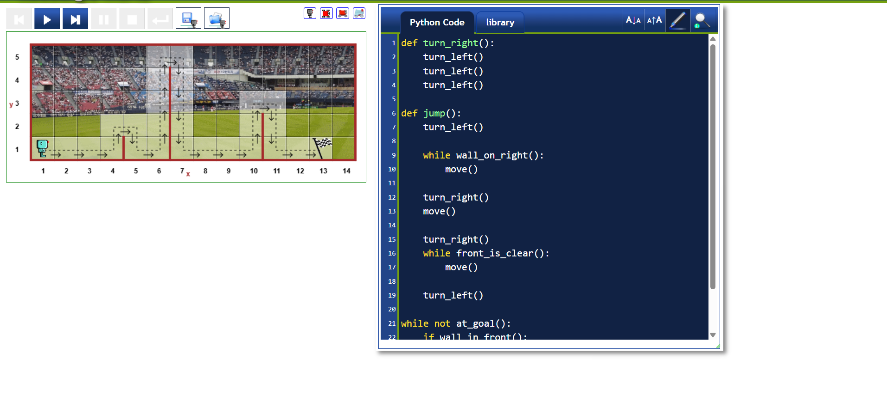

# 🏁 Reeborg’s World – Hurdles 1–3 Challenge

## 📌 Project Description

This project was completed using Reeborg’s World.

The goal was to program the robot to:
- Move forward
- Detect walls
- Jump over hurdles
- Reach the final flag

In Hurdles 1–3:
- The number of hurdles changes
- The position of hurdles changes
- The hurdle height stays the same

So the solution must be general and work in different worlds.

---

## 🧠 What I Learned

- How to create custom functions
- How to use `while` loops
- How to use `if/else` conditions
- How to check obstacles using `front_is_clear()`
- How to think logically about movement
- How to write flexible code instead of hard-coding steps

---

## 💻 My Solution Code

```python
def turn_right():
    turn_left()
    turn_left()
    turn_left()

def jump():
    turn_left()
    move()
    turn_right()
    move()
    turn_right()
    move()
    turn_left()

while not at_goal():
    if front_is_clear():
        move()
    else:
        jump()

```


## 📸 Screenshots

### Before Reaching Goal


### Final Success Message


### Before Reaching Goal


### Final Success Message


### Hurdle 3


### Hurdle 4
